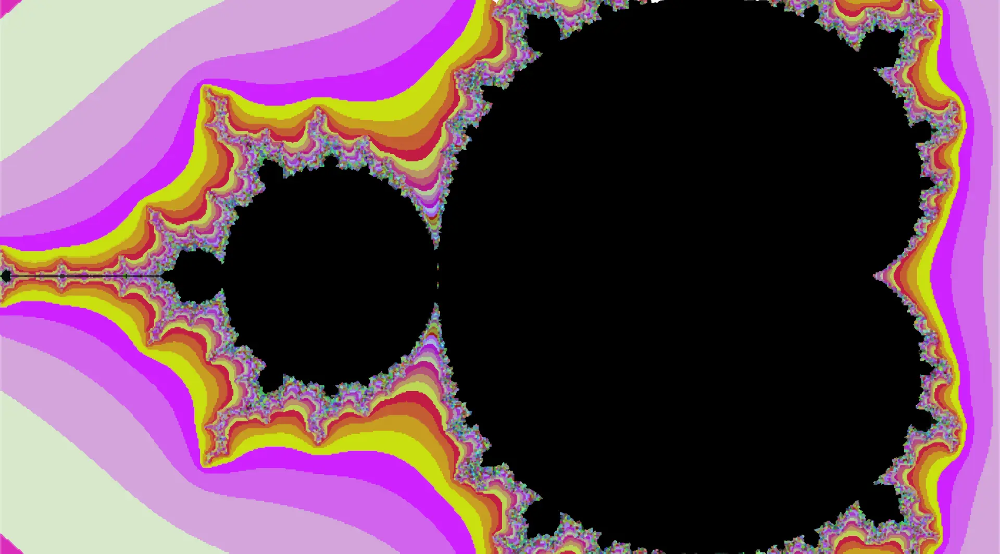
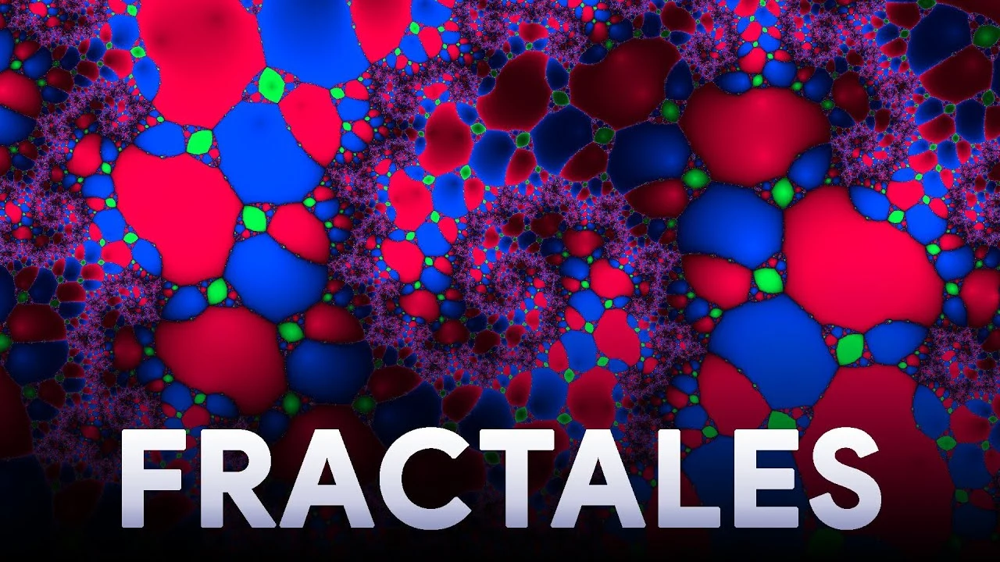
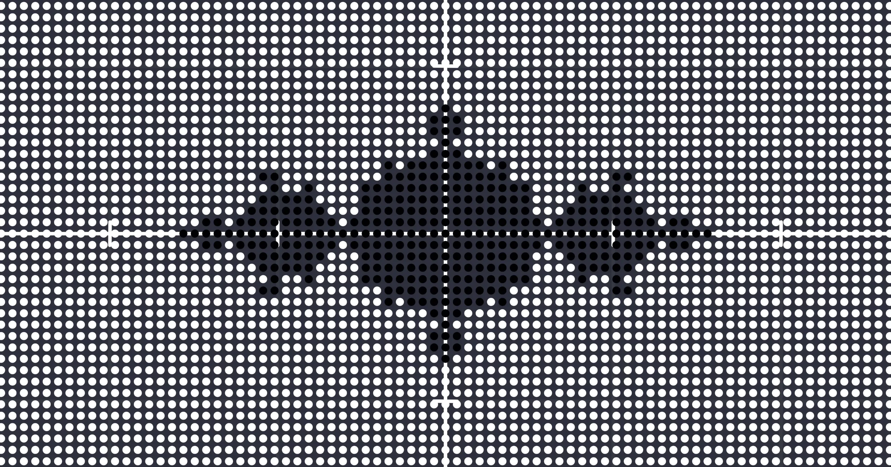
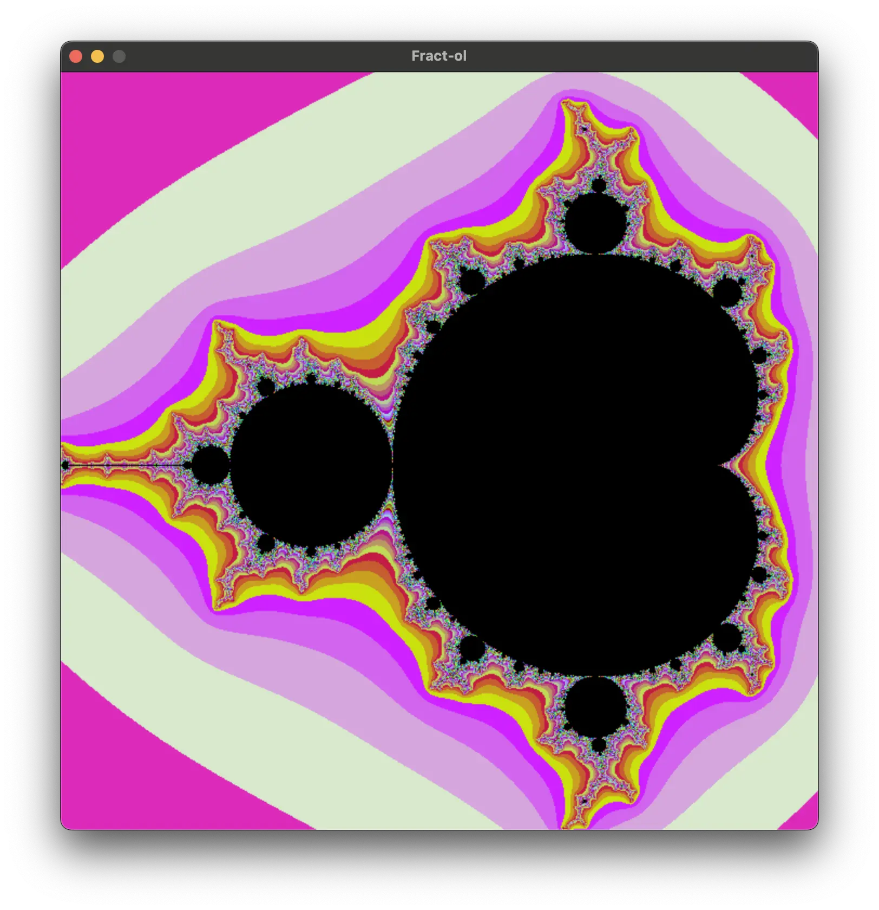
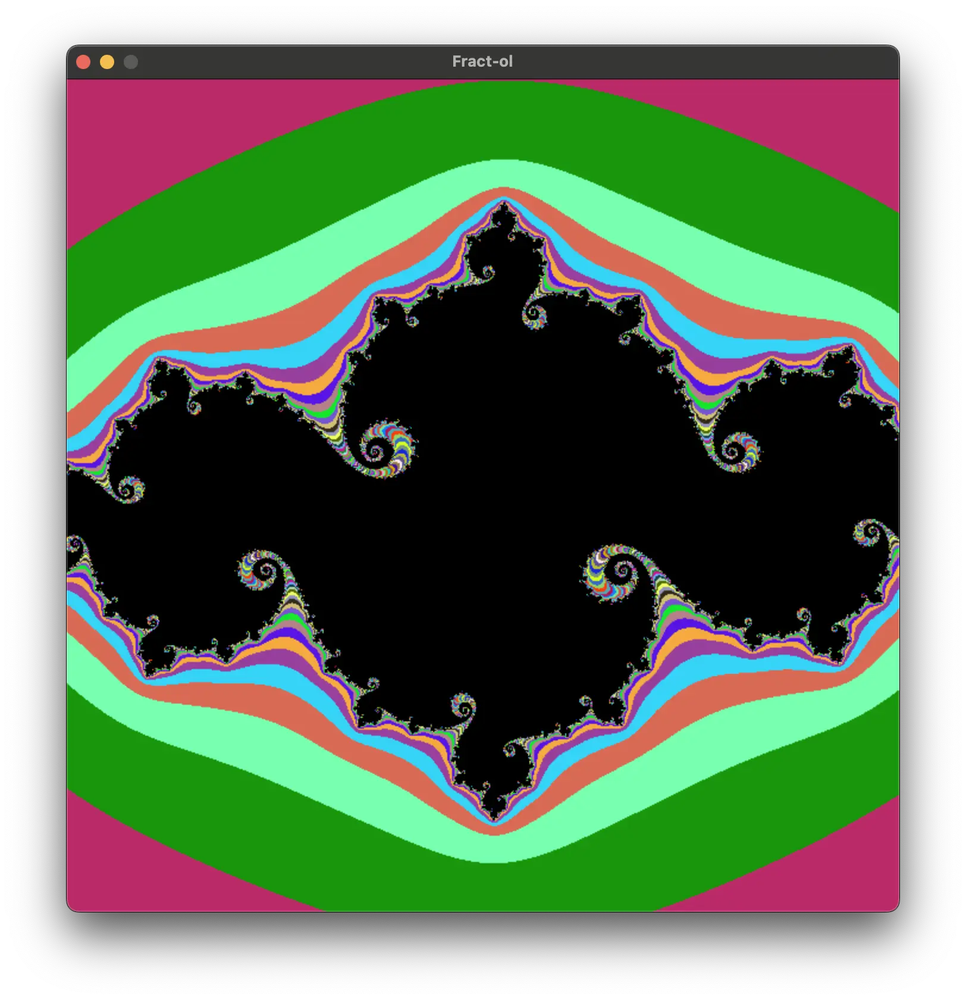
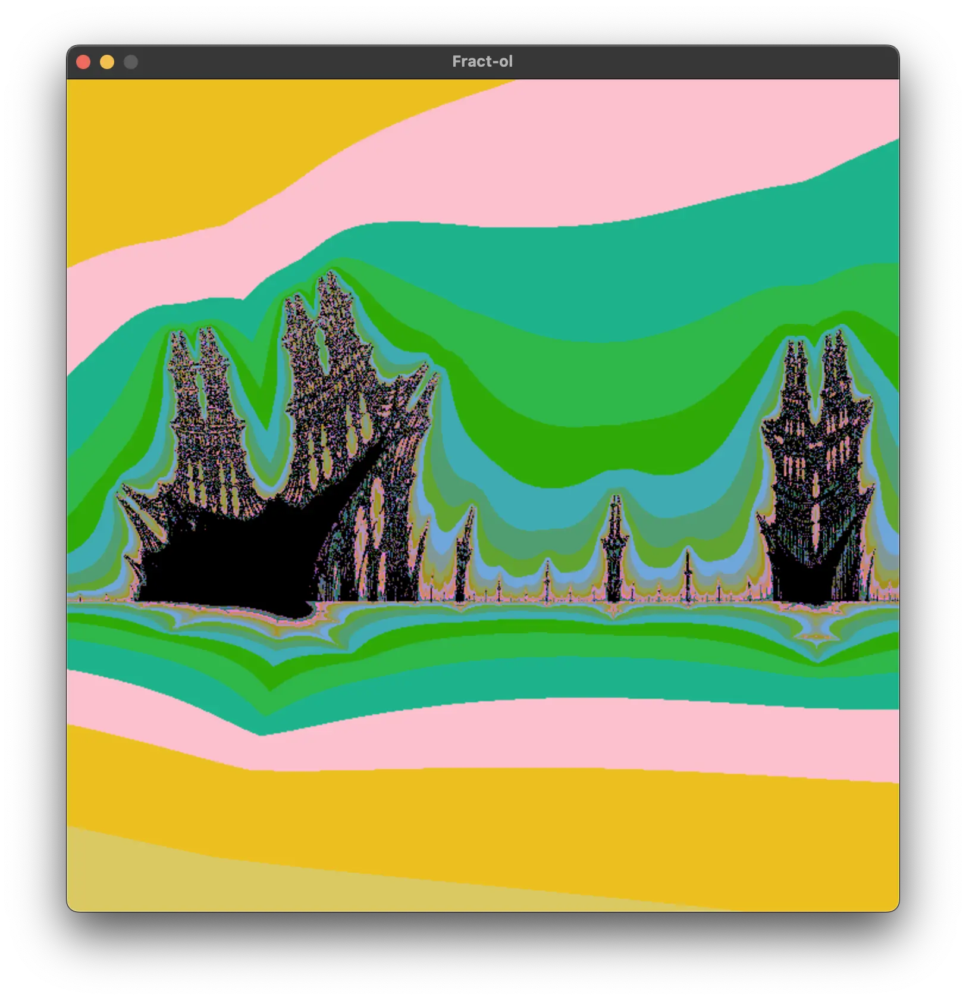

```html
<div align="center">
	<h1>🌌 fract-ol</h1>
	
	<p><b>O projeto <code>fract-ol</code> da 42 School é um dos três projetos gráficos "iniciante" do currículo. Ele ensina sobre a manipulação de uma biblioteca gráfica de baixo nível, matemática avançada e mais.</b></p>
	<p><em>⚠️ Como mencionado nas regras da 42, não copie e cole este código sem pensar, o README a seguir fornece explicações e recursos suficientes para você seguir sua própria jornada com a terrível MiniLibX ❤️</em></p>
	<a href="https://wakatime.com/badge/user/db0e5671-cec5-4e7b-9d41-19a881e67f7d/project/a74b4852-2740-4faa-8753-9239f87e3cdc">
		
	</a>
	<br />
	
	<a href="https://developer.apple.com/library/archive/documentation/Performance/Conceptual/ManagingMemory/Articles/FindingLeaks.html">
		
	</a>
	
	<br />
	
</div>

## 📖 Índice
<!--ts-->
* [⚙️ Uso](#uso)
	* [🕹 Controles](#controles)
* [🤔 Como fazer o Fract-ol?](#como-fazer-o-fract-ol)
	* [🤓 A matemática por trás dos fractais](#a-matematica-por-tras-dos-fractais)
	* [👨🏻‍💻 Da matemática para o código](#da-matematica-para-o-codigo)
* [🛠️ Funções principais](#funcoes-principais)
	* [`draw_fractal`](#draw_fractal)
	* [`calculate_mandelbrot`](#calculate_mandelbrot)
* [🌌 Demonstrações](#demonstracoes)
	* [🍑 Mandelbrot](#mandelbrot)
	* [👩🏼 Julia](#julia)
	* [🔥 Burning Ship](#burning-ship)
* [🙇🏻 Recursos e Créditos](#recursos-e-creditos)
<!--te-->

## Uso

* **Clone** o repositório

	```bash
	git clone https://github.com/leogaudin/fract-ol.git
	```

* Para **compilar** o programa, execute o seguinte comando

	```bash
	make
	```

* Para **executar** o programa, use o seguinte comando

	```bash
	./fractol <fractal>
	```

> Comandos disponíveis: `mandel`, `julia`, `ship`

### Controles

O programa suporta os seguintes controles:
<table align="center">
  <tr align="center">
    <td><b>Scroll</b></td>
    <td>Zoom</td>
  </tr>
  <tr align="center">
    <td><b>⬆️ ⬇️ ⬅️ ➡️</b></td>
    <td>Mover a visão</td>
  </tr>
  <tr align="center">
    <td><b>R</b></td>
    <td>Resetar o fractal para seu estado inicial</td>
  </tr>
  <tr align="center">
    <td><b>C</b></td>
    <td>Alterar a gama de cores</td>
  </tr>
  <tr align="center">
    <td><b>M</b> e <b>P</b></td>
    <td>Diminuir ou aumentar o número máximo de iterações</td>
  </tr>
  <tr align="center">
    <td><b>J</b></td>
    <td>Gerar novas constantes para o fractal Julia</td>
  </tr>
</table>


> 🚀 Quanto menores as iterações, mais rápido o programa será executado.
>
> 🐢 Quanto maior o zoom, mais iterações são necessárias para renderizar o fractal, tornando o programa mais lento.

## Como fazer o Fract-ol?

### A matemática por trás dos fractais

Fractais são formados por sequências matemáticas.

Por exemplo, os conjuntos Julia e Mandelbrot são definidos pela seguinte sequência:

$$
z_{n+1} = z_n^2 + c
$$

Os fractais são baseados em números complexos (ou seja, números com uma parte real e uma parte imaginária, como $z = a + bi$).

Há um ótimo vídeo do [DIMENSION CODE](https://www.youtube.com/@DIMENSIONCODE) explicando o conceito de fractais e como gerá-los, que você pode assistir aqui:

|[](https://youtu.be/wUlVFYJIUNA)|
|:-------:|
| **Comment Générer des Fractales ? ❄️** |
| *🇫🇷 Somente em francês*|

O vídeo tem cerca de 20 minutos, mas a parte que precisamos para começar pode ser resumida da seguinte forma:

* A parte $a$ (real) do número complexo é representada no eixo x.
* A parte $b$ (imaginária) do número complexo é representada no eixo y.
* Isso significa que as coordenadas $(3, 7)$ representam o número $z = 3 + 7i$, e que cada pixel de uma janela pode ser usado para representar um número complexo.
* Todo número complexo colocado na sequência irá:

	* convergir para um número finito
	* divergir para o infinito.

* Os pixels da janela podem ser coloridos dependendo se o número complexo que representam converge ou diverge.

* Se pintarmos cada pixel da janela de  se o número complexo que representa convergir ou  se divergir, já podemos ver que ele gera um fractal:

	||
	|:-------:|
	| *Captura de tela do vídeo* |

### Da matemática para o código

1. Configure a biblioteca MiniLibX.
	* Você pode encontrar bons recursos sobre como fazer isso [aqui](https://qst0.github.io/ft_libgfx/man_mlx.html).
2. Crie uma janela, imagem e tudo o que for necessário na MiniLibX.
3. Itere sobre cada pixel da janela.
	* *Veja [`draw_fractal`](#draw_fractal)*.
4. Para cada pixel, calcule o número complexo que ele representa e coloque-o na sequência.
	* *Veja [`calculate_mandelbrot`](#calculate_mandelbrot) para um exemplo*.
5. Se a sequência divergir, pinte o pixel de .
6. Se a sequência convergir, pinte o pixel de .


## Funções principais

### `draw_fractal`

```c
int draw_fractal(t_fractal *fractal, char *query, double cx, double cy)
```
Como explicado antes, esta função simplesmente itera sobre os pixels da janela e chama a função apropriada para desenhar o fractal.

### `calculate_mandelbrot`

```c
void calculate_mandelbrot(t_fractal *fractal)
```
* As variáveis $z$ são configuradas como 0, o início da sequência.

* As constantes $c$ são definidas pelas coordenadas do pixel.

* Por questões de performance, usamos o cálculo `(x * x)` em vez da função `pow(x, 2)`.

* A sequência é iterada até:

	* **O valor absoluto de z for maior que os valores máximos do sistema**: a sequência irá divergir para o infinito.

	* **O número de iterações for muito alto**: a sequência ficará presa em um loop infinito.

* Se a sequência divergir, colorimos o pixel e multiplicamos a cor pelo número de iterações para tornar as profundidades matemáticas mais claras para o olho.

***🎉 Curiosidade**: a cor do subtítulo padrão britânico,  `#FCBE11`, gera renderizações psicodélicas bem interessantes quando multiplicada pelo número de iterações*

> `calculate_julia` e `calculate_burning_ship` são muito semelhantes a `calculate_mandelbrot`, mas com equações diferentes.

## Demonstrações

### Mandelbrot

||
|:-------:|
| $z_{n+1} = z_n^2 + c$ |

### Julia

||
|:-------:|
| $c_{real} = -0.745429$ e $c_{imaginário} = 0.05$ |

### Burning Ship

||
|:-------:|
| $z_{n+1}=abs(z_n)^2+c$ |

## Recursos e Créditos

*A compreensão do conceito de fractais e a implementação do programa foi feita com a ajuda dos seguintes recursos.*

* **Princípios matemáticos, equações e tradução para o código**

	* **Comment Générer des Fractales ?**: https://www.youtube.com/watch?v=wUlVFYJIUNA

* **Uso de threads para melhorar o desempenho** (não incluído aqui por enquanto)

	* https://github.com/GlThibault/Fractol/

* **Desenho de pixels na imagem**

	> 💡 Não use `mlx_pixel_put` como eu fiz no início.
	>
	> É lento e você não pode redesenhar a tela.
	>
	> Use `mlx_put_image_to_window` em vez disso.
	* https://gontjarow.github.io/MiniLibX/mlx-tutorial-create-image.html

* **Explore mais**
	* **Outros fractais e equações**: https://fractalfoundation.org/OFC/OFC-5-5.html
```
